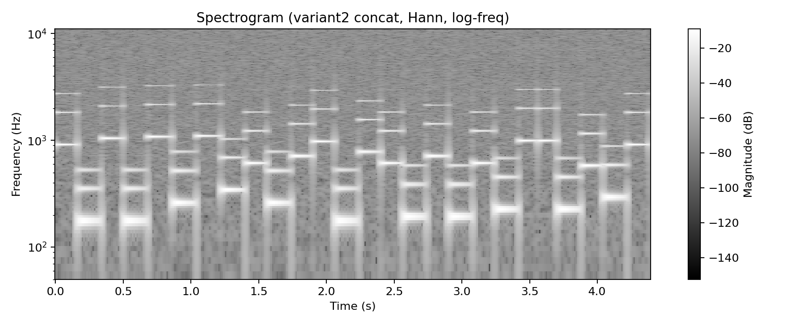
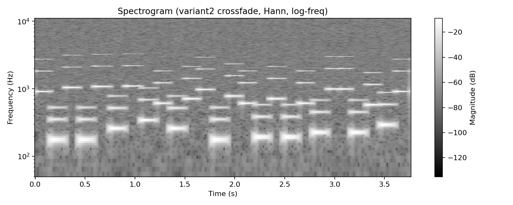

# Лабораторная работа №10 — Обработка голоса

Поддерживаются **вариант 1** и **вариант 2** (выбираются параметром `--variant`).

## Вариант 2 — Синтезатор речи (то, про что “63 файла”)
### Что требуется
1) Записать **63** одноканальных `*.wav` (фонемы/аллофоны русского языка: **23 гласных + 40 согласных**).  
2) Синтезировать фразу по фонетической транскрипции:
   - простая **конкатенация**
   - **crossfade** (перекрёстное затухание)
3) Синтезировать фразу: **«Хорошо живёт на свете Винни-Пух»**  
4) Построить **спектрограмму** (STFT, окно Ханна), частоты — **логарифмическая шкала**, сохранить в файл.

### Где 63 файла
- Инвентарь (ровно 63 имени) задан в `config/variant2.json`.
- Файлы лежат в `samples/v2_inventory/` как `samples/v2_inventory/<phone>.wav`.

Важно: я **не могу записать твой голос** вместо тебя, поэтому в репозитории лежат **демо-заглушки** (синтетические wav), чтобы было видно, что синтез/спектрограммы реально работают. Для сдачи просто **замени** эти 63 wav на свои записи с теми же именами.

### Запуск варианта 2
Установка:
`pip install -r requirements.txt`

Проверка, что все 63 файла на месте:
`python src/main.py --variant 2 --check-inventory`

Демо (сгенерирует 63 заглушки, соберёт фразу, сделает спектрограммы):
`python src/main.py --variant 2 --demo --mode both`

Результаты:
- `assets/v2_synth_concat.wav`, `assets/v2_synth_crossfade.wav`
- `assets/v2_spectrogram_concat.png`, `assets/v2_spectrogram_crossfade.png`

| Concat | Crossfade |
|---|---|
|  |  |

## Вариант 1 — голосовой диапазон, тембр, форманты

## Что требуется (по методичке)
1) Записать `*.wav` (лучше **моно**):
- `A.wav` — звук «А» с максимальным диапазоном (до 10 сек)
- `I.wav` — звук «И» аналогично
- `other.wav` — лай/мяу/крик и т.п.
2) Построить **спектрограммы** (STFT, окно **Ханна**), частоты — **логарифмическая шкала**, сохранить в файл.  
3) Найти **минимальную и максимальную частоту голоса**.  
4) Найти «наиболее тембрально окрашенный основной тон»: **F0**, у которого прослеживается максимум обертонов.  
5) Найти **3 самые сильные форманты** (Δt = 0.1с, Δf = 40–50Гц), и убедиться что для «А» и «И» они разные.

## Что сделано
- STFT спектрограммы (Hann + log-freq) сохраняются в `assets/spectrogram_*.png`
- Оценка F0 по кадрам (**кепстр** / cepstrum) → `f0_min_hz` и `f0_max_hz`
- «Самый тембральный» F0: выбирается кадр, где для F0 найдено больше всего гармоник (выше порога)
- Форманты: по окнам 0.1с строится сглаженная **огибающая лог-спектра** (кепстральное лифтирование) и выбираются 3 пика с разнесением ≥ 50Гц

## Запуск
Установка:
`pip install -r requirements.txt`

### Демо (без микрофона)
Генерирует синтетические `samples/A.wav`, `samples/I.wav`, `samples/other.wav` и выполняет анализ:
`python src/main.py --variant 1 --demo`

### Ваши записи
Положить файлы в `samples/` (или передать путями):
`python src/main.py --variant 1 --A samples/A.wav --I samples/I.wav --other samples/other.wav`

Если у вас mp3/стерео — конвертировать в моно WAV (пример ffmpeg):
`ffmpeg -i input.mp3 -ac 1 -ar 22050 samples/A.wav`

## Визуализация (спектрограммы)
| «А» | «И» | other |
|---|---|---|
|  |  |  |

Отчёт демо (все числа): `assets/demo_report.json`

## Пример результатов (из demo_report.json)
- Диапазон F0: для «А» и «И» в отчёте есть `f0_min_hz` и `f0_max_hz`
- «Самый тембральный» тон: `most_timbre_colored_f0` (частота + число гармоник)
- Форманты: `formants_summary.examples_first3_windows` (по 3 пика на окно Δt=0.1с)
