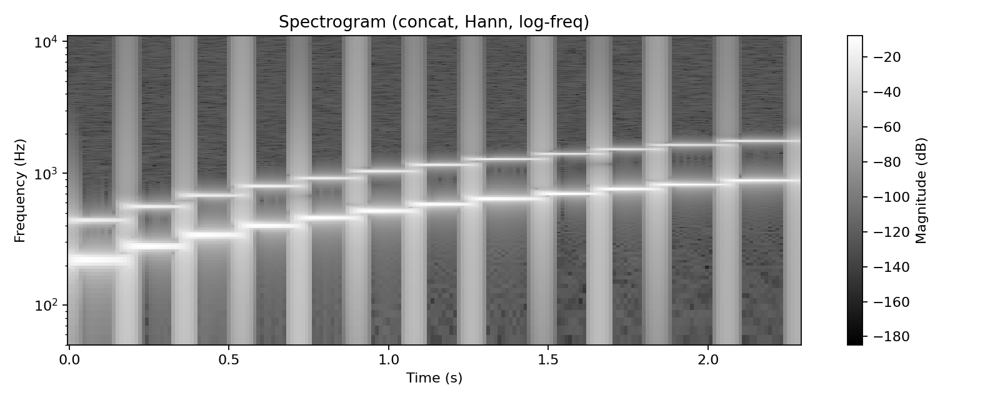
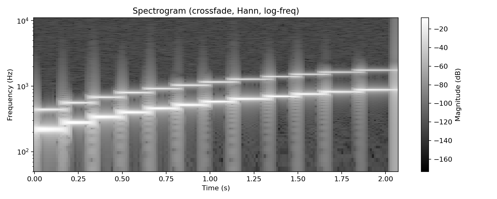

# Лабораторная работа №10 — Обработка голоса

**Вариант 2: Синтезатор речи**

## Что нужно по заданию
1) Записать **63** одноканальных `*.wav` (фонемы + аллофоны русского языка: **23 гласных + 40 согласных**).  
2) Синтезировать дорожку **по фонетической транскрипции**:
   - простая **конкатенация** образцов
   - монтаж с **перекрёстным затуханием** (crossfade)
3) Транскрибировать и синтезировать фразу: **«Хорошо живёт на свете Винни-Пух»**  
4) Построить **спектрограмму (STFT, окно Ханна)** и сохранить в файл (частоты — **логарифмическая шкала**).

## Как устроено решение
- Папка `samples/` — ваши записи: каждый образец как отдельный файл `samples/<фонема>.wav` (моно).
- Транскрипция фразы (список токенов) и параметры — в `config/variant2.json`.
- Синтез:
  - `concat` — просто склеиваем сегменты
  - `crossfade` — склейка с линейным перекрытием `crossfade_ms`
- Спектрограммы: STFT (Hann), лог-шкала частот → PNG в `assets/`.

## Запуск
Установка:
`pip install -r requirements.txt`

### Демо (без микрофона)
Создаёт синтетические «псевдо-фонемы» и строит всё автоматически:
`python src/main.py --demo`

### На ваших WAV
1) Положить файлы в `samples/` (например: `samples/хо.wav`, `samples/ро.wav`, ... — как в `config/variant2.json`).
2) Запуск:
`python src/main.py --mode both`

Если записи в mp3/стерео — конвертировать в моно WAV (пример ffmpeg):
`ffmpeg -i input.mp3 -ac 1 -ar 22050 samples/хо.wav`

## Результаты (файлы)
- `outputs/synth_concat.wav` — простая конкатенация
- `outputs/synth_crossfade.wav` — склейка с crossfade
- `assets/spectrogram_concat.png` — спектрограмма (concat)
- `assets/spectrogram_crossfade.png` — спектрограмма (crossfade)
- `assets/demo_report.json` — отчёт (если запускали `--demo`)

## Визуализация (в README)
| Конкатенация | Crossfade |
|---|---|
|  |  |
