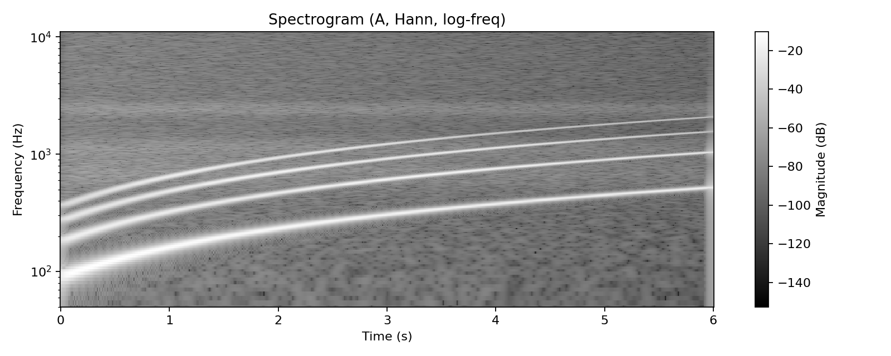
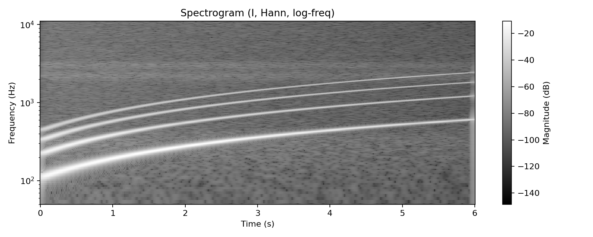
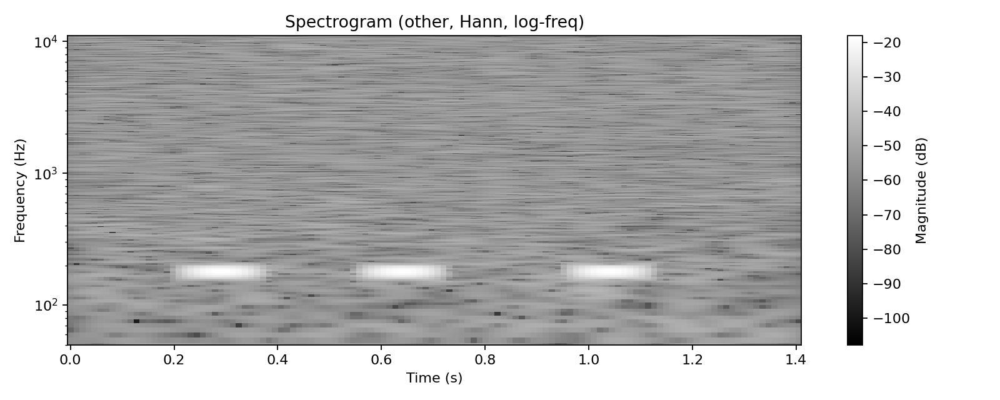

# Лабораторная работа №10 — Обработка голоса

**Вариант 1: голосовой диапазон, тембр, форманты**

## Что требуется (по методичке)
1) Записать `*.wav` (лучше **моно**):
- `A.wav` — звук «А» с максимальным диапазоном (до 10 сек)
- `I.wav` — звук «И» аналогично
- `other.wav` — лай/мяу/крик и т.п.
2) Построить **спектрограммы** (STFT, окно **Ханна**), частоты — **логарифмическая шкала**, сохранить в файл.  
3) Найти **минимальную и максимальную частоту голоса**.  
4) Найти «наиболее тембрально окрашенный основной тон»: **F0**, у которого прослеживается максимум обертонов.  
5) Найти **3 самые сильные форманты** (Δt = 0.1с, Δf = 40–50Гц), и убедиться что для «А» и «И» они разные.

## Что сделано
- STFT спектрограммы (Hann + log-freq) сохраняются в `assets/spectrogram_*.png`
- Оценка F0 по кадрам (**кепстр** / cepstrum) → `f0_min_hz` и `f0_max_hz`
- «Самый тембральный» F0: выбирается кадр, где для F0 найдено больше всего гармоник (выше порога)
- Форманты: по окнам 0.1с строится сглаженная **огибающая лог-спектра** (кепстральное лифтирование) и выбираются 3 пика с разнесением ≥ 50Гц

## Запуск
Установка:
`pip install -r requirements.txt`

### Демо (без микрофона)
Генерирует синтетические `samples/A.wav`, `samples/I.wav`, `samples/other.wav` и выполняет анализ:
`python src/main.py --demo`

### Ваши записи
Положить файлы в `samples/` (или передать путями):
`python src/main.py --A samples/A.wav --I samples/I.wav --other samples/other.wav`

Если у вас mp3/стерео — конвертировать в моно WAV (пример ffmpeg):
`ffmpeg -i input.mp3 -ac 1 -ar 22050 samples/A.wav`

## Визуализация (спектрограммы)
| «А» | «И» | other |
|---|---|---|
|  |  |  |

Отчёт демо (все числа): `assets/demo_report.json`

## Пример результатов (из demo_report.json)
- Диапазон F0: для «А» и «И» в отчёте есть `f0_min_hz` и `f0_max_hz`
- «Самый тембральный» тон: `most_timbre_colored_f0` (частота + число гармоник)
- Форманты: `formants_summary.examples_first3_windows` (по 3 пика на окно Δt=0.1с)
